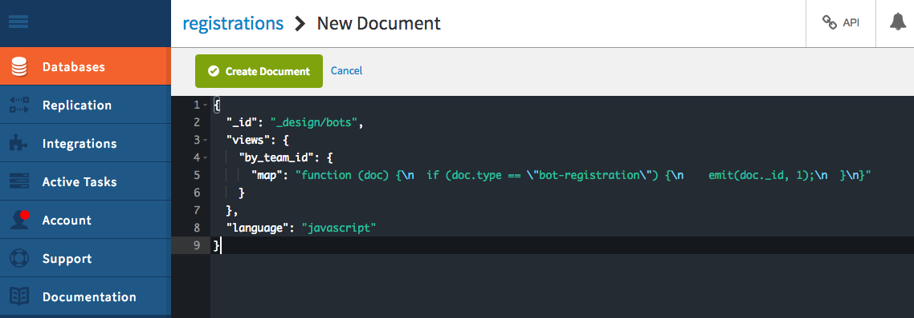
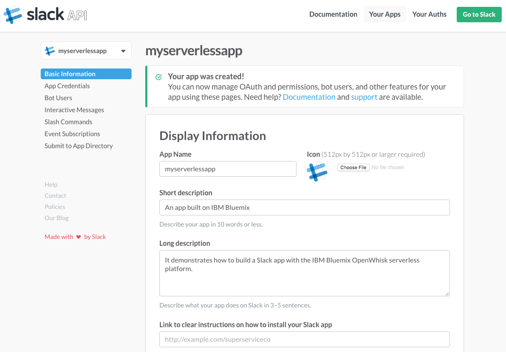
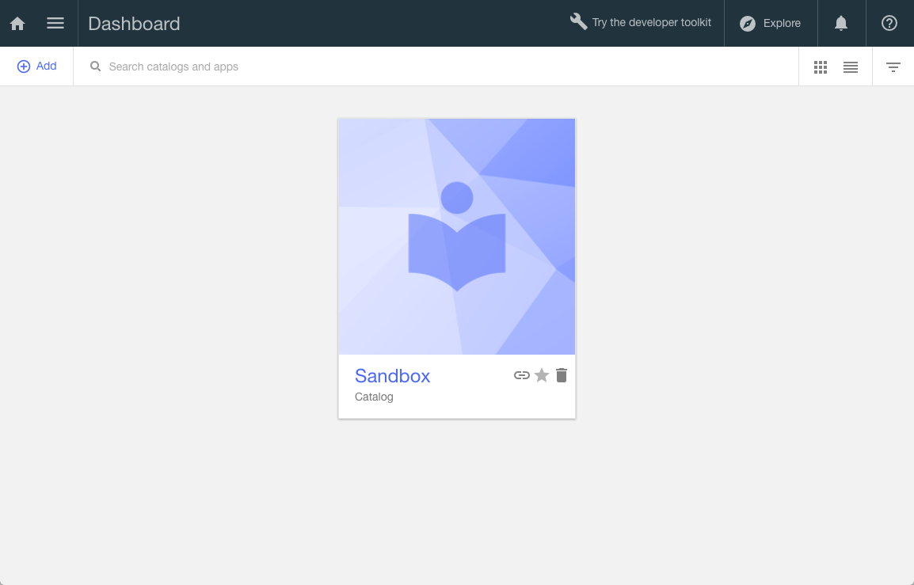
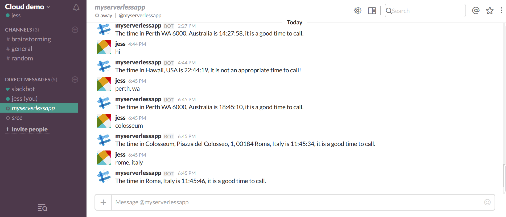
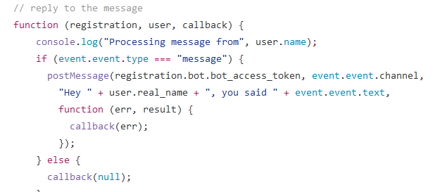

# CITS5503-serverless-slack-world-clock-app

This is the code for the CITS5503 - Cloud computing project for a serverless Slack app that tells the user if it is an appropriate time to call a certain location depending on the input address. The app is built with IBM Bluemix OpenWhisk, API Connect, Slack Events API and Google API.

The following sample will not describe in detail how to create or set up the application as a developer as that is explained in: https://github.com/IBM-Bluemix/openwhisk-slackapp. The serverless chat bot produced by following the tutorial could only echo the user's message and was essentially useless and only existed in order to demonstrate the serverless architecture; my added world clock functionality was built on top of that serverless chat bot. Actions such as setting up Cloudant DB, deploying OpenWhisk actions and the actual creation of the Slack application are all explained in the adorementioned link.

  
  
  

## Overview

When a user installs the app in a Slack team or interacts with a bot user, Slack calls the app implementation and talks to an API deployed with API Connect. In turn this API will invoke OpenWhisk actions. From the perspective of the developer of the Slack app, there is no server involved: only OpenWhisk actions and an API in API Connect. Furthermore if no user interacts with the app then the code will not run.

Built using IBM Bluemix, the app uses:

 * OpenWhisk - to implement the app bot and commands
 * Cloudant - to keep track of app installations
 * API Connect - to provide the gateway/expose the OpenWhisk actions to Slack
 * Slack Events API - streamlined, easy way to build apps and bots that respond to activities in Slack
 * Google Geocoding API - to find formatted address, lat and long to pass to Timezone API
 * Google Timezone API - to find the timezone of location

## Funcional Requirements
* The system should allow any user in the Slack team it's deployed in to access it's direct message channel.
* The system should allow user's to chat with the bot.
* The system should inform the user when their address input does not return any recognisable location.
* The system should return a message stating a formatted address of the user's location input, what time it is currently at that location and whether it would be an appropriate time to call according to said time.

## Non-functional Requirements

* The system should maintain an easy to us interface accross all functionality and for all users.
* The system should be able to return a response within 5 seconds.
* The client's user interface should be compatible with all commonly used browsers.
* The system should be able to scale based on the number of users using the system.

## Instructions

To access application, you will need to:

1. Get in touch with a Team Admin - If you haven’t received an invitation yet, contact an Administrator on the team and ask them to 
send (or resend) your invite.

2. Accept invitation - Once you’ve been invited to join a Slack team, the first step is setting up your account. Just click the link
 in your email invitation to get started:
 
 * Check your inbox for an invitation to join a Slack team.  
 * Click the Join button.
 * On the signup page, enter your first and last name and choose a username.
 * When you’re ready, click Next.
 * Choose a password, then click Join team

3. If the "myserverlessapp" is not visible, click the direct messages tab on the left to reveal it.

## Clock Functionality

The world clock functionality was added into the [slackapp-events.js] file in actions folder, which handles events triggered by the Events API;  [slackapp-registration.js] remained unchanged while [slackapp-command.js] was not utlized. All files in repository are needed for the application to run on the developer's side but only the event was editted to provide extra functionality as it was the most interactive way to communicate with the bot (compared to /command).

Clock functionality was created using Google APIs in order to find the location of the address (lat, long from Geocodig API) and 
timezone of said location (timezoneID from Timezone API). This information was then, in turn, used to find out a string of the
current time in that area and then converted into numbers in order to create the decision point for calling. Message is then posted back to the channel.

## Problems

1. Openwhisk does not allow the installation of external libraries/packages. If the Timezone microJS library was able to be utilised
the code would not look half as convoluted and ugly.

2. When trying to make the added functionalities modular (passing lat, long from values returned by function involving GeocodeAPI to function involving timezone API to get timezone) Openwhisk will keep throwing up an error saying 'main is undefined' even
though the 'main' function was always defined as it was legacy code pulled from github. This resulted in one big function but
uncertain as to why such a problem existed.

3. Originall when calling the clock function in the post message section further down the script, the application would take far too long to respond. Therefore, the post message function needed to be called in the actual clock function. Ultimately, the order was flipped. This problem may have been the result of the legacy code and Javascript being asynchronous.

4. I had next to zero knowledge or experience in Javascript coding until about 2 weeks ago so logic and quality of code is very
poor.

## Possible improvment

* Adding more of an explanation for users as to what the bot actually does in the Slack app would make it less confusing for first time users e.g. having them initiate conversation by stating something along the lines of "Please enter a location and I will tell you if it is an appropriate time to call".
* Make the response more personal by also stating the user's name.
* Slack fixing their Events API so the bot doesn't appear away when it is online
* OpenWhisk allowing ways to install external libraries

## References

* https://github.com/IBM-Bluemix/openwhisk-slackapp - Tutorial followed - built basic severless Slack app. Most original files retained from this repository but they're needed to run the app developer side. Clock functionality was only added to [slackapp-events.js] in actions folder.
* https://www.ibm.com/blogs/bluemix/2016/08/serverless-slack-app-with-bluemix-openwhisk/ - Simple overview of tutorial
* https://api.slack.com/
* https://developers.google.com/maps/documentation/geocoding/intro - Google Geocoding API site
* https://developers.google.com/maps/documentation/timezone/start - Google Time Zone API site
* http://www.w3schools.com/jsref/jsref_tolocaletimestring.asp - toLocaleTimeString
* https://msdn.microsoft.com/library/474de325(v=vs.94).aspx - toLocaleTimeString

